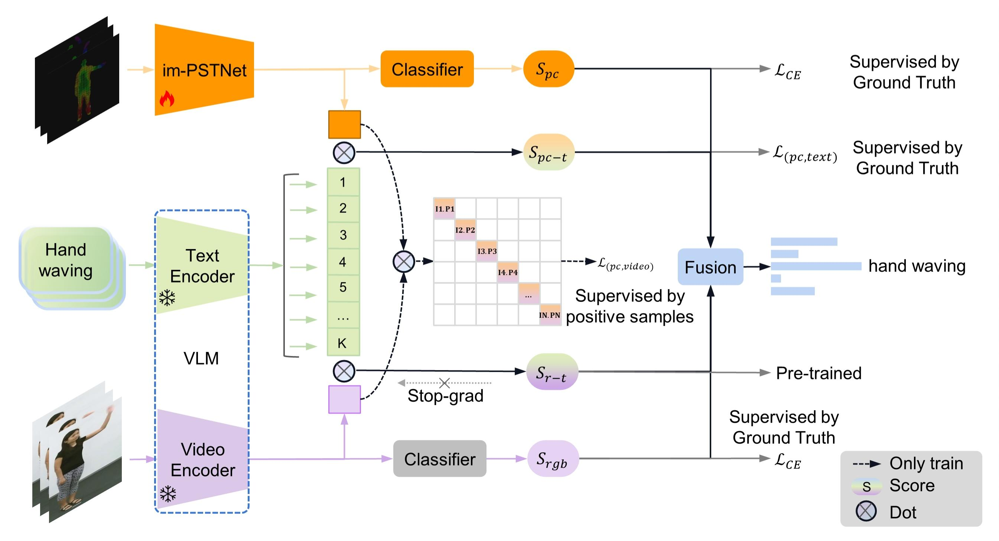

# VG4D
## VG4D: Vision-Language Model Goes 4D Video Recognition（ICRA 2024）
The code will be available soon.
<br />
<p align="center">
  <h1 align="center">VG4D: Vision-Language Model Goes 4D Video Recognition</h1>
  <p align="center">
    ICRA, 2024
    <br />
    <a href="https://github.com/Shark0-0"><strong>Zhichao Deng</strong></a>
    ·
    <a href="https://lxtgh.github.io/"><strong>Xiangtai Li</strong></a>
    ·
    <a href="https://xialipku.github.io/"><strong>Xia Li</strong></a>
    ·
    <a href=""><strong>Yunhai Tong</strong></a>
    <br />
    <a href=""><strong>Shen Zhao</strong></a>
    .
    <a href="https://www.ece.pku.edu.cn/info/1046/2596.htm"><strong>Mengyuan Liu*</strong></a>
  </p>

  <p align="center">
    <a href='https://arxiv.org/pdf/2303.12782'>
      
    </a>
    <a href='' style='padding-left: 0.5rem;'>
      
    </a>
  </p>
<br />

**VG4D Framework**



## News

- The code will be available before the meeting 

[[Paper]]() [[CODE]](https://github.com/Shark0-0/VG4D)


## Citation

If you think VG4D is useful for your research, please consider referring VG4D:

```bibtex

@inproceedings{deng2024vg4d,
  title={VG4D: Vision-Language Model Goes 4D Video Recognition},
  author={Zhichao Deng, Xiangtai Li, Xia Li, Yunhai Tong, Shen Zhao, Mengyuan Liu},
  booktitle={ICRA},
  year={2024}
}

```

## License

MIT 
